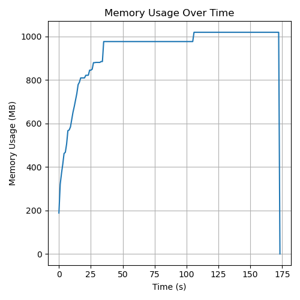
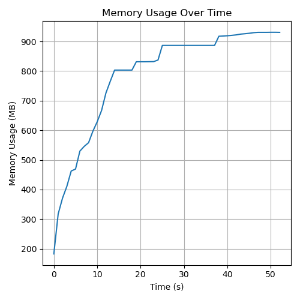
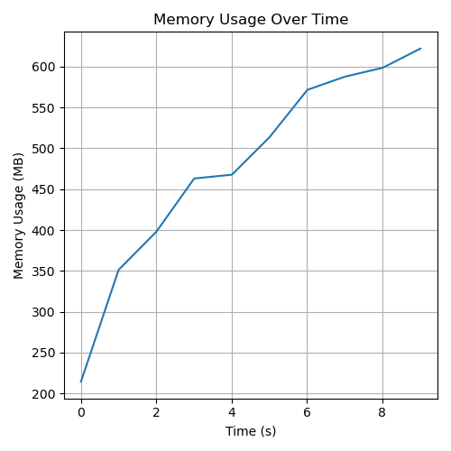
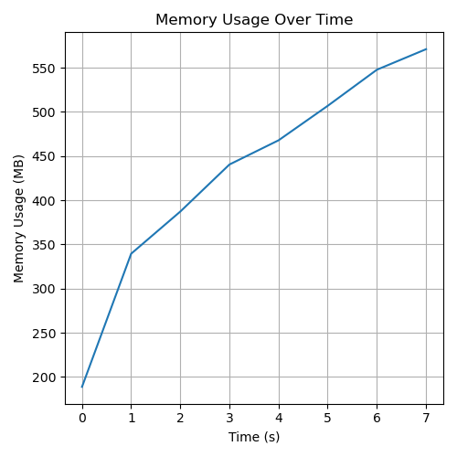

# Benchmarks

##  Memory usage for reading

Two files were read, each containing 892 events and approximately 4.2 GB of data.

All collections of an event accessed using `ReadEvent`:

All collections of an event accessed using `RDataFrame.Define` without further processing:

`MCParticles` and `PandoraPFOs` of an event accessed using `ReadEvent`:

`MCParticles` and `PandoraPFOs` of an event accessed using `RDataFrame.Define` without further processing:

The reported time includes environment setup, invocation of Define or ReadEvent, and just-in-time (JIT) compilation. Therefore, it does not accurately reflect the time required solely for reading events.

Source code can be found in `../tests/testMemoryLeak`.
